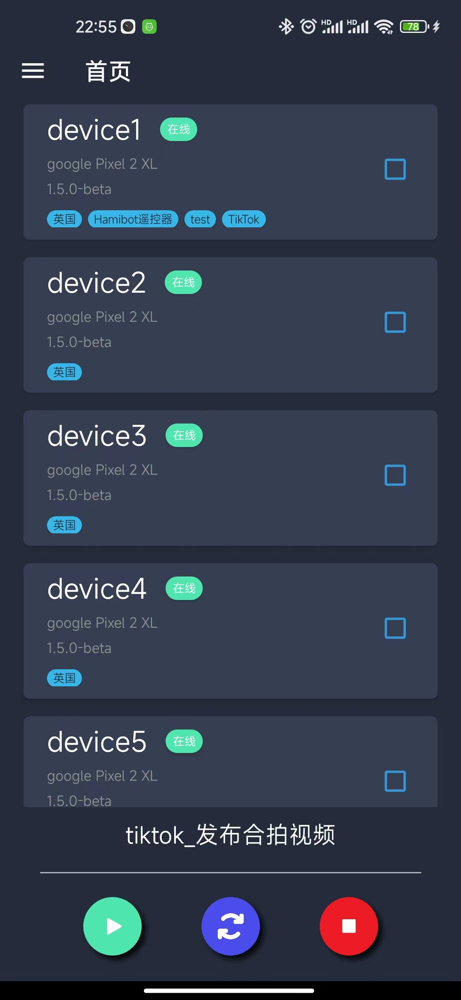
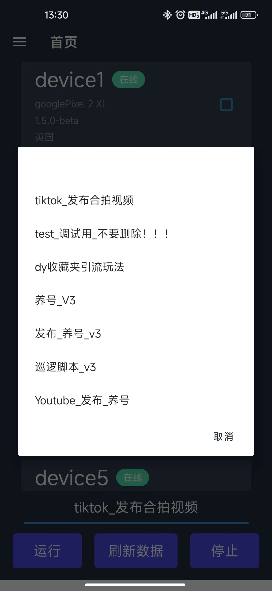
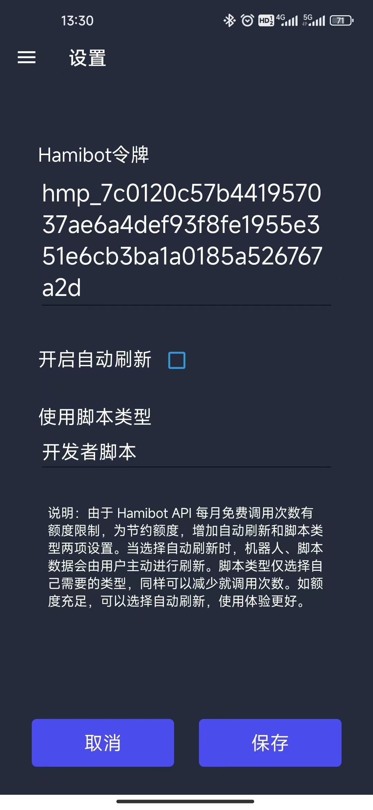
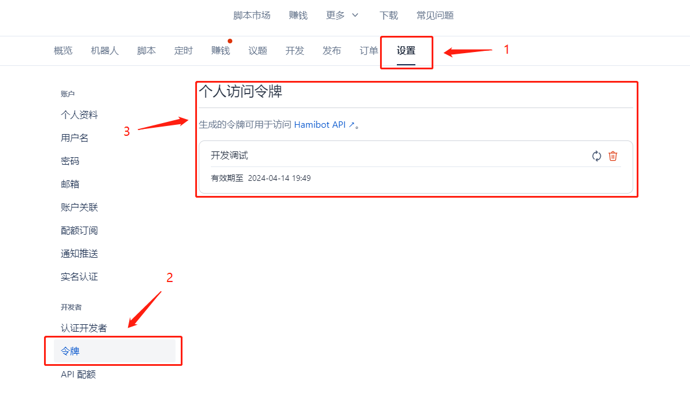
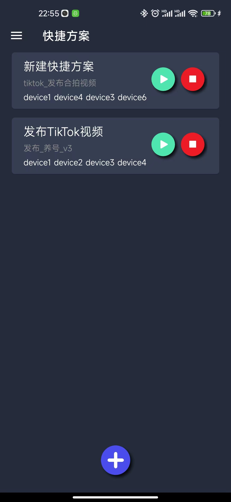
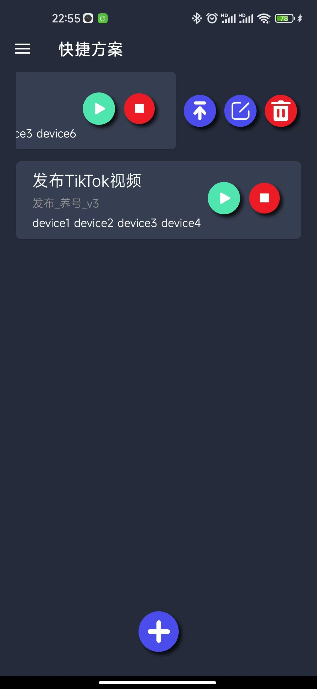
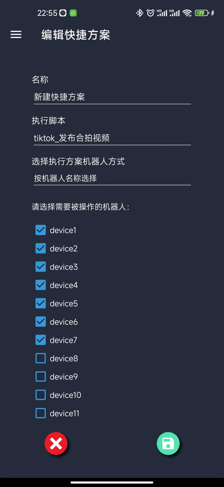

    

<h2 align="center">Hamibot遥控器</h2>

Hamibot遥控器是基于Hamibot官方开放的API接口开发的一款自动化脚本运行控制APP

    
    
    

## 简介

[Hamibot](https://hamibot.com/) 是一款适用于安卓系统的自动化工具，能操控任意 APP，实现自动化操作，提高工作效率。 

由于Hamibot官方当前只提供了网页控制台操作和定时执行两种方式来管理脚本的运行，只能通过网页端来查看状态和执行操作，使用起来不是很方便。但是提供了官方API供用户使用：https://docs.hamibot.com/rest/overview/。

Hamibot遥控器就是基于这个前提开发的供用户使用的可以通过app查看机器人状态、执行脚本运行操作的开源第三方工具。

## 使用效果

    
    
    

## 使用方法

### 配置API

1. 注册Hamibot：https://hamibot.com/referrals/m7ax
2. 在“设置-开发者-令牌”中获取个人访问令牌。
3. 安装Hamibot遥控器。
4. 打开设置填入个人令牌。

个人令牌获取位置：

### 快捷方案

【快捷方案】功能是本项目自行添加，Hamibot官方并没有此类功能。添加这个功能的目的是为了可以根据常用使用配置快速调用。本功能相关配置信息只会保留在本地，无法根据账号在云端同步。

    
    
    

【快捷方案】可以对选定的脚本配置需要使用的机器人，在使用时，直接运行快捷方案即可，不需要每次都去选择脚本和机器人。

选择机器人的方式有根据机器人和根据Tag两种方式。如果选择根据机器人，则运行时被操作的就是被选中的机器人；如果选中的是根据Tag，则会选中选中Tag下的所有机器人。

快捷方案的操作有运行和停止两种。

在快捷方案列表中，左滑方案项，可以对被滑动的方案进行编辑或删除等操作。

## 功能

### 现有功能

当前支持的功能都是根据官方API开发，主要提供了以下几个功能：

1. 获取机器人、脚本信息。
2. 运行脚本。
3. 停止脚本运行。
4. 设置API请求方式。
5. 设置“快捷方案”，用于快速执行脚本操作。
6. 版本升级提醒。

### TODO

1. 支持修改机器人
2. 支持隐藏不需要的脚本、机器人。
3. 支持统计API调用次数统计。

## 注意

由于API为官方提供，使用本软件时需要遵守官方的使用规范。

API配额当前为每月300次，超出使用额度后，如需继续使用需要到官网自行购买。为节省额度，建议在app设置中将自动刷新关闭，只在必要的时候手动进行机器人列表、脚本列表的更新。脚本类型可以只获取自己使用的类型，也会减少API请求次数。

当然，如果额度足够，开启自动刷新会获得更好的使用体验。

## 其他

如有任何好的建议和使用问题，可以联系作者进行交流。

    

##  免责声明

**本项目开发初衷仅为学习及技术交流，切勿将其用于任何非法用途，否则一切后果自负，与本项目及作者无关。**